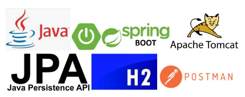

# Autor: Marcos Vinicius

# Solução Back-end para	Gerenciar Sessões de Votação em Assembleias

No cooperativismo, cada associado possui um vote e as decisões são tomadas em assembleias, por votação.
A partir disso, você precisa criar uma solução back-end para gerenciar essas sessões de votação.
Essa solução deve ser executada na nuvem e promover as seguintes funcionalidades através de uma API REST:

● Cadastrar uma nova schedule;

● Abrir uma sessão de votação em uma schedule (a sessão de votação deve ficar aberta por um tempo determinado na chamada de abertura ou 1 minuto por default);

● Receber votes dos associados em pautas (os votes são apenas 'Sim'/'Não'. Cada associado é identificado por um id único e pode votar apenas uma vez por schedule);

● Contabilizar os votes e dar o resultado da votação na schedule.

Para fins de exercício, a segurança das interfaces foi abstraída e qualquer chamada para as interfaces em consideração é autorizada.
A linguagem escolhida foi Java, e acabei utilizando algumas ferramentas como o Spring, JPA, H2 e Postman.
Algumas escolhas tomadas durante o desenvolvimento dessa aplicação me acrescentaram muitos novos conhecimentos e muitas novas idéias,
que me fizeram transformar as mesmas em algo simples mas ao mesmo tempo limpo e funcional.

# Utilização Pelo Usuário

O responsável pela assembleia deve cadastrar os associados que ficarão aptos a votar, o mesmo também terá que cadastrar uma schedule de votação.
Após estes dois pré-requisitos estarem concluídos, pode-se abrir uma votação com o padrão de 1 minuto.
Durante a votação, os votantes podem fazer seu vote com a opção Sim ou Não, quando concluído o tempo de votar, o sistema informará o resultado.